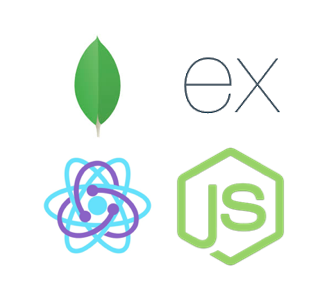

It goes without saying that the MERN stack is one of the most popular stacks for modern web development and, as a result, there exist many boilerplates. However, in my opinion most of these boilerplates include more than is necessary to get started. While it is nice to have what is included I prefer to take a more additive approach when developing. Therefore, I desired something more minimal.


For this project I distilled down whats included to what I always find myself using throughout all my MERN projects. For my build tools I've included Webpack 4 and Babel. On the front-end I've included Redux, Redux-saga, Axios and Styled Components. For the back-end the only extra library that is added,aside from Mongoose, is Morgan for logging. Finally, for testing I've included Mocha, Chai and Enyzme.


## Project structure

```bash
client/
    components/
    constants/
    containers/
    dist/
    reducers/
    styles/
    app.js
    index.html
    reducer.js
    store.js
    testSetup.js

sever/
    controllers/
    logs/
    models/
    routes/
    services/
    app.js
```


## The client

The client is where the React project resides. The purpose of each folder and file is the following:

- **components** - where all presentational components go. Here I like to give each component its own folder and in the folder have the following files

```bash
ComponentName/
    index.js
    test.js
    styles.scss (if not using styled components)
```

- **constants** - Where the action types for redux are places.

- **containers** - For any components that provide data and behavior to any presentational component. These are usually reserved for components that interface with Redux.

- **reducers** - For Redux reducers.

- **styles** - Any global styles go here.

- **dist** - Where the project is built when calling ```npm run deploy:client```.

- **app.js** - The entry point for the react app.

- **index.html** - The HTML file, pretty standard.

- **reducer.js** - Where reducers are combined.

- **store.js** - The store code for Redux.

- **testSetup.js** - Sets up js-dom and enzyme for unit testing.


#### Included components

I've included in this project some useful components I created and find myself reusing quite a lot. Below is a picture of all the components in action together:


- **Navbar** - Just a simple Navbar with the option to add a logo and include links.

- **Card** - Standard card component, Allows one to set the image, title, paragraph and button link.

- **Billboard** - A card-like component that allows one to set the background and display a call to action styled message along with a link as a button. For an example see the first row middle column in the image above.

- **Masonry** - A 3 column masonry grid for displaying cards. I found myself displaying card grids throughout may of my projects and often times than not the images are of different heights. Using a traditional grid, this will result in extra whitespace and miss-alignment. So I decided to implement my own Masonry component. While it is not as flexible as something like Masonry.js, it gets the job done for what I want.

## The server

Nothing really fancy here, I've just included the typical directories:


- **models** - Mongoose models.

- **controllers** - Functions for fetching and preparing data from models.

- **logs** - Self explanatory.

- **routes** - Endpoints in the app.

- **services** - Bits of code that can be reused by controllers. For for example a function to fetch data that is used in multiple places.